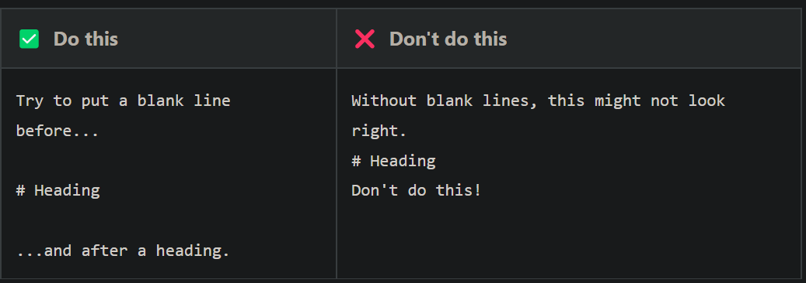

# dio-github-noob-ptoject

Desafio básico de projeto sobre Git/Hub

## The git has four lifecycle

- untracked;
- unmodified;
- modified;
- staged.

## Git basic commands

**git init** : Initialize the git local repository;  
**git add file** : send the file to the staging area.   
**git reset file** : get back the file to its previous stage.   
**git commit -m comment** : all the files in staging area will be send to the local repository.  
**git push repository branch** : run this command will push the current snapshot to the remote repository.     
**git status** : shows the current stage of the files.   
**git pull repository branch** : receive locally all the changes made at remote repository.  

## Markdown basic syntax

### headings

- Heading Best practices  
  

### Line Breaks

* How to create line breaks    

## JavaScript Basic Concepts

* Executando arquivo .js no bash: node file;  
